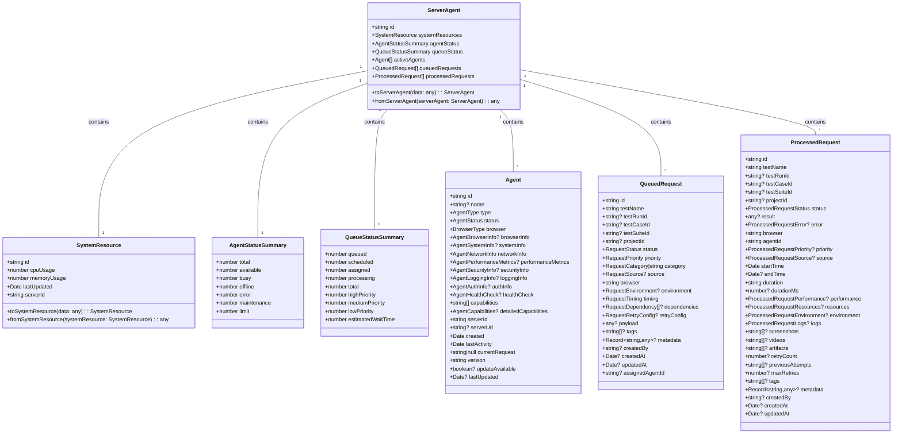
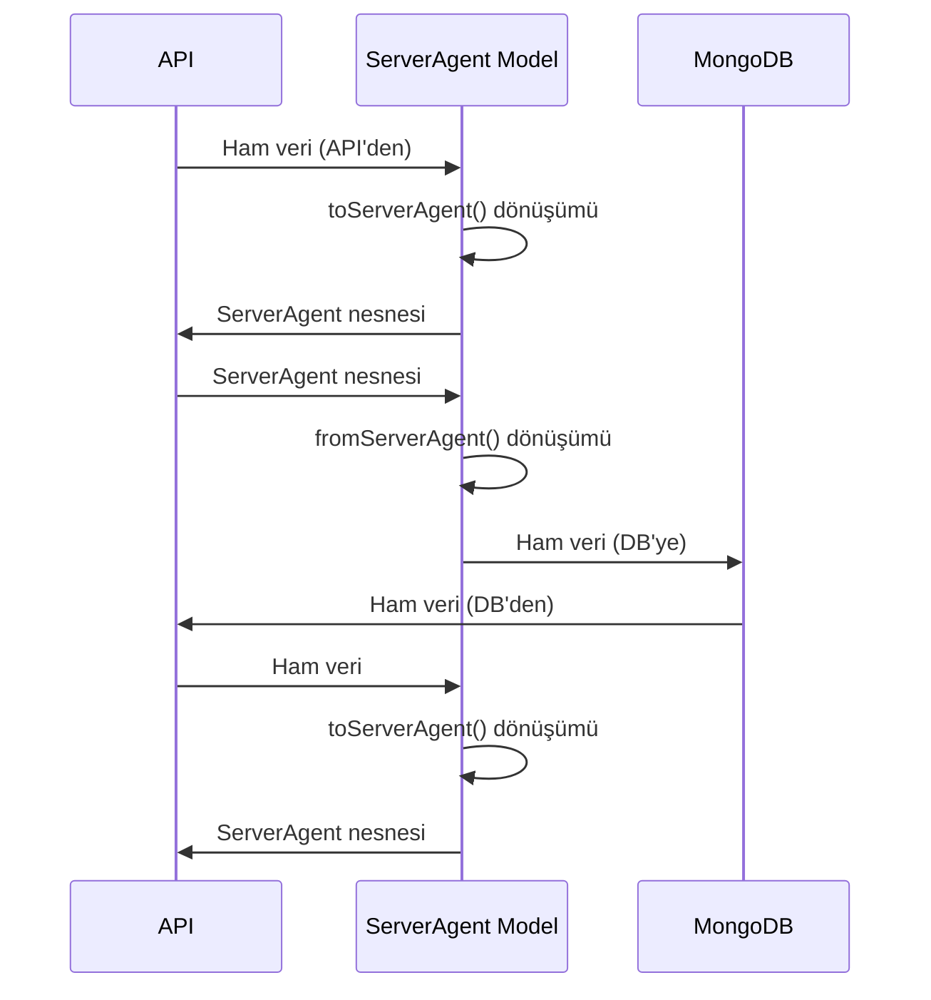

# ServerAgent Mimari Diyagramı

Bu belge, `src/models/ServerAgent.ts` dosyasının mimari yapısını görsel olarak göstermektedir.

## Sınıf Diyagramı (Mermaid)

## İlişki Diyagramı (Mermaid)

```mermaid
graph TD
    A[ServerAgent] --> B[SystemResource]
    A --> C[AgentStatusSummary]
    A --> D[QueueStatusSummary]
    A --> E[Agent Collection]
    A --> F[QueuedRequest Collection]
    A --> G[ProcessedRequest Collection]
    
    E --> E1[Agent 1]
    E --> E2[Agent 2]
    E --> E3[Agent ...]
    
    F --> F1[QueuedRequest 1]
    F --> F2[QueuedRequest 2]
    F --> F3[QueuedRequest ...]
    
    G --> G1[ProcessedRequest 1]
    G --> G2[ProcessedRequest 2]
    G --> G3[ProcessedRequest ...]
    
    subgraph "Agent Details"
        E1 --> E1_1[Browser Info]
        E1 --> E1_2[System Info]
        E1 --> E1_3[Network Info]
        E1 --> E1_4[Performance Metrics]
        E1 --> E1_5[Security Info]
        E1 --> E1_6[Health Check]
        E1 --> E1_7[Capabilities]
    end
    
    subgraph "QueuedRequest Details"
        F1 --> F1_1[Status & Category]
        F1 --> F1_2[Environment]
        F1 --> F1_3[Timing]
        F1 --> F1_4[Dependencies]
        F1 --> F1_5[Retry Config]
        F1 --> F1_6[Metadata]
    end
    
    subgraph "ProcessedRequest Details"
        G1 --> G1_1[Status & Result]
        G1 --> G1_2[Execution Details]
        G1 --> G1_3[Timing]
        G1 --> G1_4[Performance]
        G1 --> G1_5[Environment]
        G1 --> G1_6[Logs & Artifacts]
        G1 --> G1_7[Retry Info]
        G1 --> G1_8[Metadata]
    end
```

## Veri Akış Diyagramı (Mermaid)

## Özet

ServerAgent modeli, test otomasyon sisteminin sunucu durumunu temsil eden merkezi bir modeldir. Bu model, sunucu kaynakları, ajan durumu, kuyruk durumu, aktif ajanlar, kuyrukta bekleyen istekler ve işlenmiş istekler gibi bilgileri içerir. Model, ham veriyi model yapısına ve model yapısını ham veriye dönüştürmek için fonksiyonlar sağlar.
