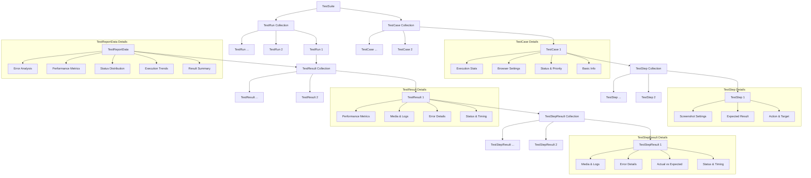
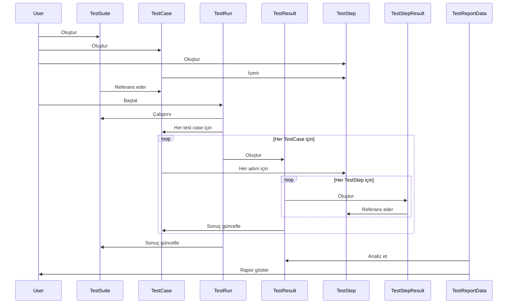

# Test Modelleri Mimari Diyagramı

Bu belge, test otomasyon sistemindeki TestCase, TestSuite, TestRun, TestStep, TestResult ve TestReport modellerinin mimari yapısını görsel olarak göstermektedir.

## Sınıf Diyagramı (Mermaid)

```mermaid
classDiagram
    class TestCase {
        +string id
        +string title
        +string description
        +TestCaseStatus status
        +TestCasePriority priority
        +TestStep[] steps
        +string[] tags
        +string projectId
        +BrowserType[] browsers
        +boolean headless
        +boolean browserPool
        +string createdBy
        +Date createdAt
        +Date updatedAt
        +TestCaseExecutionStats executionStats
    }
    
    class TestStep {
        +string id
        +number order
        +TestStepActionType action
        +string target
        +TestStepTargetType targetType
        +string value
        +string description
        +string expectedResult
        +boolean screenshot
        +boolean isManual
    }
    
    class TestSuite {
        +string id
        +string name
        +string description
        +TestSuiteStatus status
        +TestSuitePriority priority
        +number progress
        +string[] testCases
        +string projectId
        +string[] tags
        +TestSuiteExecutionMode executionMode
        +number maxParallelExecutions
        +TestSuiteRetryStrategy retryStrategy
        +number maxRetries
        +TestCaseDependency[] dependencies
        +TestSuiteDependencyMode dependencyMode
        +BrowserType[] browsers
        +boolean headless
        +boolean browserPool
        +TestSuiteSchedule schedule
        +TestSuiteNotification notifications
        +string assignee
        +Date startDate
        +Date endDate
        +string environment
        +string createdBy
        +Date createdAt
        +Date updatedAt
        +TestSuiteResults results
    }
    
    class TestRun {
        +string id
        +string name
        +string description
        +TestRunStatus status
        +TestRunPriority priority
        +string testSuiteId
        +string environment
        +string[] tags
        +TestRunExecutionMode executionMode
        +number maxParallelExecutions
        +TestRunRetryStrategy retryStrategy
        +number maxRetries
        +BrowserType[] browsers
        +boolean headless
        +boolean browserPool
        +TestRunLogging logging
        +TestRunReporting reporting
        +TestRunNotification notifications
        +TestRunContext context
        +Date startTime
        +Date endTime
        +number duration
        +TestResult[] results
        +TestRunStats stats
        +string agentId
        +string createdBy
        +Date createdAt
        +Date updatedAt
    }
    
    class TestResult {
        +string id
        +string testRunId
        +string testCaseId
        +string testSuiteId
        +string name
        +string description
        +TestResultStatus status
        +TestPriority priority
        +TestSeverity severity
        +Date startTime
        +Date endTime
        +number duration
        +string environment
        +TestEnvironmentInfo environmentInfo
        +string errorMessage
        +string errorStack
        +TestErrorDetails errorDetails
        +string[] screenshots
        +TestMedia[] media
        +TestPerformanceMetrics performanceMetrics
        +TestNetworkInfo networkInfo
        +string[] logs
        +string[] consoleOutput
        +TestStepResult[] steps
        +TestRetryInfo retryInfo
        +Record~string,any~ metadata
        +string[] tags
        +string[] categories
        +string traceId
        +string spanId
    }
    
    class TestStepResult {
        +string id
        +number order
        +string description
        +string expectedResult
        +string actualResult
        +TestStepResultStatus status
        +number duration
        +Date startTime
        +Date endTime
        +string errorMessage
        +TestStepErrorDetails errorDetails
        +string screenshot
        +TestStepMedia[] media
        +TestStepPerformanceMetrics performanceMetrics
        +string[] logs
        +string[] consoleOutput
        +number retryCount
        +string[] previousAttempts
        +Record~string,any~ metadata
        +string[] tags
    }
    
    class TestReportData {
        +TestResultSummary resultSummary
        +TestExecutionTrendData executionTrend
        +StatusDistributionData statusDistribution
        +DurationByStatusData durationByStatus
        +ErrorDistributionData errorDistribution
        +PerformanceMetricsData performanceMetrics
        +TestCoverageData testCoverage
        +TestQualityMetrics qualityMetrics
        +TestReportSummary reportSummary
        +ComparativeReportData comparativeData
        +CustomReportConfig customConfig
    }
    
    TestCase "1" *-- "many" TestStep : contains
    TestSuite "1" o-- "many" TestCase : references
    TestRun "1" --> "1" TestSuite : executes
    TestRun "1" *-- "many" TestResult : produces
    TestResult "1" --> "1" TestCase : references
    TestResult "1" *-- "many" TestStepResult : contains
    TestStepResult "1" --> "1" TestStep : references
    TestReportData "1" --> "many" TestResult : analyzes
```

## İlişki Diyagramı (Mermaid)

## Veri Akış Diyagramı (Mermaid)

## Veritabanı Şema Diyagramı (Mermaid)

```mermaid
erDiagram
    TestSuite ||--o{ TestCase : contains
    TestSuite ||--o{ TestRun : has
    TestCase ||--o{ TestStep : contains
    TestRun ||--o{ TestResult : produces
    TestResult ||--o{ TestStepResult : contains
    TestResult }|--|| TestCase : references
    TestStepResult }|--|| TestStep : references
    
    TestSuite {
        ObjectId _id
        string id
        string name
        string description
        enum status
        enum priority
        number progress
        string[] testCases
        string projectId
        string[] tags
        enum executionMode
        number maxParallelExecutions
        enum retryStrategy
        number maxRetries
        object[] dependencies
        enum dependencyMode
        enum[] browsers
        boolean headless
        boolean browserPool
        object schedule
        object notifications
        string assignee
        date startDate
        date endDate
        string environment
        string createdBy
        date createdAt
        string updatedBy
        date updatedAt
    }
    
    TestCase {
        ObjectId _id
        string id
        string title
        string description
        enum status
        enum priority
        object[] steps
        string[] tags
        string projectId
        enum[] browsers
        boolean headless
        boolean browserPool
        string createdBy
        date createdAt
        date updatedAt
        object executionStats
    }
    
    TestStep {
        ObjectId _id
        string id
        number order
        enum action
        string target
        enum targetType
        string value
        string description
        string expectedResult
        boolean screenshot
        boolean isManual
        string testCaseId
    }
    
    TestRun {
        ObjectId _id
        string id
        string name
        string description
        enum status
        enum priority
        string projectId
        string testSuiteId
        string[] testCaseIds
        string environment
        enum[] browsers
        boolean headless
        boolean browserPool
        enum executionMode
        number maxParallelExecutions
        enum retryStrategy
        number maxRetries
        number timeout
        object context
        object logging
        object reporting
        object notifications
        string[] results
        object stats
        date scheduledStart
        date startTime
        date endTime
        number duration
        string[] tags
        string createdBy
        date createdAt
        string updatedBy
        date updatedAt
        string notes
        string[] artifacts
        object metadata
    }
    
    TestResult {
        ObjectId _id
        string id
        string testRunId
        string testCaseId
        string testSuiteId
        string name
        string description
        enum status
        enum priority
        enum severity
        date startTime
        date endTime
        number duration
        string environment
        object environmentInfo
        string errorMessage
        string errorStack
        object errorDetails
        string[] screenshots
        object[] media
        object performanceMetrics
        object networkInfo
        string[] logs
        string[] consoleOutput
        string[] steps
        object retryInfo
        object metadata
        string[] tags
        string[] categories
        string traceId
        string spanId
        date createdAt
        date updatedAt
    }
    
    TestStepResult {
        ObjectId _id
        string id
        string testResultId
        string testStepId
        number order
        string description
        string expectedResult
        string actualResult
        enum status
        number duration
        date startTime
        date endTime
        string errorMessage
        object errorDetails
        string screenshot
        object[] media
        object performanceMetrics
        string[] logs
        string[] consoleOutput
        number retryCount
        string[] previousAttempts
        object metadata
        string[] tags
        date createdAt
        date updatedAt
    }
```

## Modüler Yapı Diyagramı (Mermaid)

```mermaid
graph TD
    A[src/models] --> B[interfaces]
    A --> C[enums]
    A --> D[utils]
    A --> E[database]
    
    B --> B1[TestCase.ts]
    B --> B2[TestSuite.ts]
    B --> B3[TestRun.ts]
    B --> B4[TestStep.ts]
    B --> B5[TestResult.ts]
    B --> B6[TestStepResult.ts]
    B --> B7[TestReportData.ts]
    
    C --> C1[TestCaseEnums.ts]
    C --> C2[TestSuiteEnums.ts]
    C --> C3[TestRunEnums.ts]
    C --> C4[TestStepEnums.ts]
    C --> C5[TestResultEnums.ts]
    
    D --> D1[TestCaseUtils.ts]
    D --> D2[TestSuiteUtils.ts]
    D --> D3[TestRunUtils.ts]
    D --> D4[TestStepUtils.ts]
    D --> D5[TestResultUtils.ts]
    D --> D6[TestStepResultUtils.ts]
    D --> D7[TestReportDataUtils.ts]
    
    E --> E1[schemas]
    E --> E2[repository]
    
    E1 --> E1_1[TestCaseSchema.ts]
    E1 --> E1_2[TestSuiteSchema.ts]
    E1 --> E1_3[TestRunSchema.ts]
    E1 --> E1_4[TestStepSchema.ts]
    E1 --> E1_5[TestResultSchema.ts]
    E1 --> E1_6[TestStepResultSchema.ts]
    
    E2 --> E2_1[TestCaseRepository.ts]
    E2 --> E2_2[TestSuiteRepository.ts]
    E2 --> E2_3[TestRunRepository.ts]
    E2 --> E2_4[TestResultRepository.ts]
    
    A --> F[TestCase.ts]
    A --> G[TestSuite.ts]
    A --> H[TestRun.ts]
    A --> I[TestStep.ts]
    A --> J[TestResult.ts]
    A --> K[TestStepResult.ts]
    A --> L[TestReportData.ts]
    
    F -.-> B1
    F -.-> C1
    F -.-> D1
    
    G -.-> B2
    G -.-> C2
    G -.-> D2
    
    H -.-> B3
    H -.-> C3
    H -.-> D3
    
    I -.-> B4
    I -.-> C4
    I -.-> D4
    
    J -.-> B5
    J -.-> C5
    J -.-> D5
    
    K -.-> B6
    K -.-> C5
    K -.-> D6
    
    L -.-> B7
    L -.-> D7
```

## Özet

Test otomasyon sistemindeki modeller, test senaryolarının tanımlanması, çalıştırılması ve sonuçlarının raporlanması için kapsamlı bir yapı sağlar. Bu modeller, test otomasyon sisteminin temelini oluşturur ve sistemin esnekliğini ve genişletilebilirliğini sağlar.

Mimari, modüler bir yapıda tasarlanmıştır ve her model için arayüz, enum, util ve veritabanı şema bileşenleri bulunmaktadır. Bu modüler yapı, kodun bakımını ve genişletilmesini kolaylaştırır.

İlişkiler, TestSuite -> TestCase -> TestStep ve TestRun -> TestResult -> TestStepResult şeklinde hiyerarşik bir yapıda düzenlenmiştir. Bu yapı, test senaryolarının organizasyonunu ve çalıştırılmasını kolaylaştırır.
